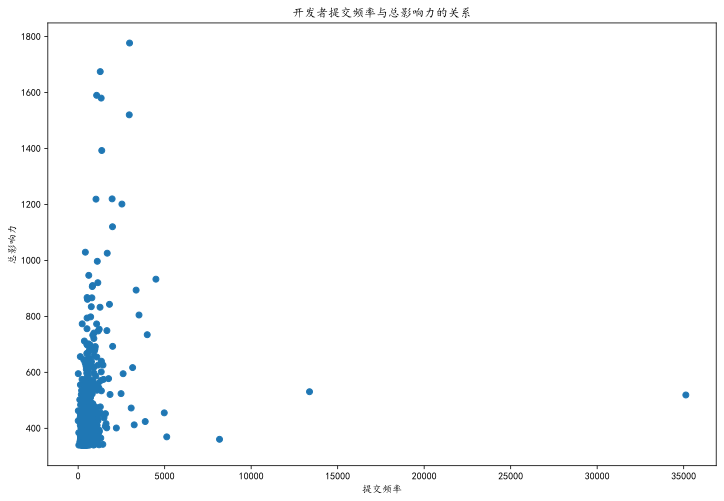

## 基于开源数据的开发者行为分析报告

### 一、引言
本报告旨在对开源项目开发者的行为进行深入分析，通过对开发者的人口统计信息、协作行为等多方面数据的挖掘，揭示开发者群体的特征和行为模式，为开源项目的管理、社区建设以及进一步的研究提供有价值的参考。

### 二、数据来源与处理
#### （一）数据获取
- 本次分析的数据来源于对开源项目相关信息的收集，包括开发者的个人信息（如用户 ID、姓名、所在地区等）以及他们在项目中的协作行为记录（如提交事件等）。数据以 CSV 格式存储，通过pandas库的read_csv函数进行读取，共涉及 500 个用户的信息。
#### （二）时区处理
- 为了便于后续对不同地区开发者行为的分析，构建了一个时区字典timezone，将国家与对应的时区信息进行关联。在处理开发者所在国家数据时，通过查找该字典，为每个开发者添加了时区信息。对于国家信息不在字典中的开发者，标记为 “Unkno”。
#### （三）数据清洗与转换
1. 去除重复数据
- 使用drop_duplicates函数对包含开发者个人信息的数据进行去重操作，确保每个开发者的信息在数据集中唯一。这一步骤有助于提高数据的准确性，避免重复统计对分析结果的干扰。
2. 数据格式调整
- 在处理过程中，对一些数据进行了格式转换，以适应后续的分析需求。例如，将字符串类型的数据转换为数值类型（如果适用），以便进行数值计算和比较。

### 三、人口统计分析


#### （一）开发者国家分布


1. 统计方法
- 通过定义函数getNum和showNum，对开发者所在国家的出现次数进行统计。getNum函数遍历开发者信息中的国家列，使用pd.isna函数跳过空值，对每个国家进行计数，并将结果存储在字典country中。然后，showNum函数对统计结果进行排序，取出现次数最多的前num个国家（num=-1表示全部），绘制条形图展示国家与开发者数量的分布关系。
2. 分布情况
- 从绘制的 “人数 - country 分布图” 中可以看出，开发者来自多个国家，分布较为广泛。部分国家的开发者数量较多，如中国（China）有 59 人，美国（United States）有 40 人，印度（India）有 34 人等。这反映出这些国家在开源项目开发领域具有较高的参与度，可能与这些国家的科技发展水平、开源文化普及程度以及相关产业需求等因素有关


#### （二）开发者地区分布


    
1. 统计方法
- 采用类似国家分布统计的方法，定义showLocationOfCountry函数，对开发者所在地区（location列）进行统计。先使用getNum函数统计每个地区的出现次数，存储在字典location中，再通过showNum函数取前 30 个地区进行可视化展示。
2. 分布特点
- 在 “人数 - location 分布图” 中，展示了不同地区的开发者数量差异。一些地区如 “CN”（可能代表中国的某个特定地区或泛指中国）有较多的开发者，其他地区的开发者数量相对较少且分布较为分散。这可能暗示着开源项目在某些地区更为集中，可能受到当地技术氛围、高校和企业分布等因素的影响。

#### （三）开发者时区分布

    


1. 统计方法
- 同样利用getNum和showNum函数，对开发者的时区（timezone列）进行统计和可视化。时区信息有助于从时间维度分析开发者的活动规律，例如不同时区的开发者在协作时可能面临不同的工作时间重叠情况。
2. 分布特征
- 从 “人数 - timezone 分布图” 可以看出，“UTC + 8:00” 时区（涵盖中国、马来西亚、新加坡、台湾地区、香港地区等）的开发者数量最多，达到 176 人。这与之前中国地区开发者数量较多相呼应，进一步表明该时区所在地区在开源项目开发中的重要地位。其他常见时区如 “UTC - 5:00”（美国、加拿大等部分地区）、“UTC + 1:00”（荷兰、瑞士、德国、法国等欧洲国家）也有一定数量的开发者，反映出开源项目的全球性参与特点。


### 四、 协作行为分析


    {'MilosKozak': 35993,
     'arlac77': 14460,
     'danielroe': 9160,
     'PX4BuildBot': 8273,
     'ConfluentSemaphore': 7836,
     'taiki-e': 4985,
     ···,
     'JesperSchulz': 35,
     'segraef': 8,
     'fit2cloudrd': 5,
     'tmcconechy': 2,
     'Jenefer-Monroe': 0,
     'meeseeksmachine': 0,
     'fundawang': 0}

#### （一）提交次数统计
1. 数据筛选
- 首先，从原始数据中筛选出事件类型为 “PushEvent”（提交事件）的数据，存储在ndata变量中。然后，通过遍历开发者姓名列表，统计每个开发者的提交次数，将结果存储在字典pushtims中。
2. 结果排序与分析
- 对pushtims字典按照提交次数进行降序排序，得到开发者的提交次数排名。提交次数较多的开发者如 “MilosKozak”（35993 次）、“arlac77”（14460 次）、“danielroe”（9160 次）等，可视为高活跃用户，他们在项目中频繁提交代码，对项目的推进和发展贡献较大。而提交次数较少的开发者如 “segraef”（8 次）、“fit2cloudrd”（5 次）、“tmcconechy”（2 次）等，为低活跃用户，其在项目中的参与度相对较低。通过设定贡献值阈值（如贡献值大于等于 1000 为高活跃用户，小于 100 为低活跃用户），对开发者进行了分类，发现 500 个用户中低活跃度用户相对较少，这表明整体开发者群体在该开源项目中具有一定的活跃度。

#### （二）高活跃与低活跃开发者分析
1. 高活跃用户
- 可以将贡献值（对应这里给出的数值）相对较高的一部分用户视为高活跃用户，比如选取贡献值大于等于 1000 的用户，以下是部分示例（仅列举前面一些符合条件的用户）：
- MilosKozak：贡献值为 35993，是活跃度很高的用户，可能在众多事务、项目等中频繁参与并做出大量贡献。
- arlac77：贡献值 14460，活跃度也较为突出，在相应领域有着积极表现。
- danielroe：9160 的贡献值，同样属于比较活跃地参与相关活动、贡献力量的用户。
2. 低活跃用户
- 相应地，把贡献值较低的用户视为低活跃用户，例如选取贡献值小于 100 的用户，部分示例如下：
- segraef：贡献值仅为 8，相对来说参与度和活跃度很低。
- fit2cloudrd：只有 5 的贡献值，在整体活跃度方面处于较低水平。
- tmcconechy：贡献值为 2，属于活跃度不高的用户。


```python
#我们按这个标准继续区分用户
high_activity = list()
low_activity = list()
for x in pushtims.items():
    if x[1] >= 1000:
        high_activity.append(x[0])
    elif x[1]<100 :
        low_activity.append(x[0])
print("高活跃度用户：{}".format(high_activity))
print("低活跃度用户：{}".format(low_activity))
```

    高活跃度用户：['MilosKozak', 'arlac77', 'danielroe', 'PX4BuildBot', 'ConfluentSemaphore', 'taiki-e', 'bot-targa', 'chenrui333', 'ornicar', 'Ghost-chu', 'LinuxServer-CI', 'XuehaiPan', 'khipp', 'matthuisman', 'bdraco', 'frenck', 'Exorcism0666', 'mauro-balades', 'Jason2866', 'SimonCropp', 'NickCao', 'SuperSandro2000', 'vmoens', 'cdce8p', 'ChrisRackauckas', 'mcm1957', 'melloware', 'gwolf2u', 'eldy', 'fire', 'nijel', 'gaborcsardi', 'ankane', 'brianchandotcom', 'terrymanu', 'stipsan', 'glenn-jocher', 'martincostello', 'moosebuild', 'tianon', 'charliermarsh', 'mencian', 'sdelamo', 'AskAlexSharov', 'Koenkk', 'rouault', 'kdy1', 'suzuki-shunsuke', 'ryanbr', 'avik-pal', 'igorpecovnik', 'arsenm', 'boubaker', 'andy31415', 'tjbck', 'linawolf', 'blaggacao', 'Bekacru', 'beckermr', 'chenjiahan', 'wsmoses', 'lszomoru', 'Mic92', 'dimaMachina', 'timtebeek', 'o1lab', 'hugovk', 'amotl', 'BeryJu', 'spytheman', 'fabaff', 'crynobone', 'kim-em', 'Dream-Master', 'crazy-max', 'joostlek', 'khaneliman', 'jsoref', 'taylorotwell', 'Octobob']
    低活跃度用户：['KoBeWi', 'zhangdaiscott', 'JesperSchulz', 'segraef', 'fit2cloudrd', 'tmcconechy', 'Jenefer-Monroe', 'meeseeksmachine', 'fundawang']
    

由此看来这500个用户中低活跃度用户还是比较少的。


### 五、开发者行为活跃度的时间关联

#### （一）提交频率随时间变化分析
1. 数据处理与计算
- 定义函数calculate_submission_frequency来计算每个开发者在不同时间段（以周为单位）的提交频率。通过筛选出event_type为PushEvent的数据，然后按照开发者和时间周期（周）进行分组统计。
```python
#定义函数计算每个开发者在不同时间段（如每月）的提交频率
def calculate_submission_frequency(data):
    submission_data = data[data['event_type'] == 'PushEvent']
    submission_frequency = submission_data.groupby(['name', pd.Grouper(key='event_time', freq='W')]).size().reset_index(name='submission_count')
    return submission_frequency
submission_frequency = calculate_submission_frequency(data)
```
2. 可视化展示与分析
- 选择几个具有代表性的开发者（如bdraco、XuehaiPan、samsonasik），绘制他们的提交频率随时间变化的曲线。
    

    
- 从图中可以看出：
- bdraco的提交频率在 2021 - 04 - 08 至 2021 - 07 - 01 期间达到峰值，随后有所下降，但整体仍保持较高的活跃度。这可能表明在该时间段内，项目处于关键开发阶段，需要大量的代码提交来推进项目进展。之后提交频率下降可能是因为项目进入了相对稳定的维护期，或者开发者的工作重心发生了转移，但他仍然保持着一定的参与度，对项目的持续改进和问题修复提供支持。
- XuehaiPan的提交频率相对较为平稳，在 2021 - 10 - 07 至 2021 - 12 - 30 期间有较为明显的提交高峰。这种平稳的提交频率说明该开发者在项目中的工作节奏较为稳定，可能负责一些常规的功能开发或持续的优化工作。而提交高峰可能与项目的特定需求或任务安排有关，例如在该时间段内需要完成某个重要功能模块的开发或应对项目的紧急需求。
- samsonasik的提交频率波动较大，在 2021 - 04 - 08 至 2021 - 07 - 01 期间有较高的提交次数，之后活跃度有所降低。较大的波动可能暗示该开发者的工作受项目需求变化的影响较大，或者其个人的工作安排不够稳定。在高提交频率期间，可能是全身心投入到项目的核心开发任务中，而活跃度降低可能是由于任务完成后暂时没有新的重要任务分配，或者是受到其他因素（如个人原因、参与其他项目等）的影响。

### 六、 开发者影响力和活跃度的关联分析
#### （一）衡量指标定义
1. 开发者影响力
- 影响力是指开发者在项目中所产生的作用和效果，本报告中使用total_influence列作为开发者影响力的衡量指标，该指标可能综合考虑了开发者在项目中的贡献、声誉等因素。例如，在一些开源项目中，开发者的影响力可能与他们所提交代码的被引用次数、解决的关键问题数量、对项目社区的贡献等相关。较高的总影响力意味着开发者在项目中具有更重要的地位和更大的话语权，其决策和建议可能对项目的发展方向产生更大的影响。
2. 开发者活跃度
- 活跃度反映了开发者参与项目的频繁程度，本报告主要以提交频率作为开发者活跃度的衡量指标。提交频率通过计算开发者在一定时间内（如每周）的代码提交次数来衡量。较高的提交频率通常表示开发者在项目中投入了更多的时间和精力，积极参与项目的开发和改进工作。然而，活跃度不仅仅局限于提交代码，还可以包括参与项目讨论、代码审查、文档编写等其他活动，但在本分析中，重点关注提交频率与影响力之间的关系。

#### （二）数据处理与分析方法
1. 提交频率计算（再次提及以保持连贯性）
- 定义函数calculate_submission_frequency2来计算每个开发者的总提交次数（与之前按周计算提交频率的函数有所不同，这里计算的是总体提交次数）。通过筛选出event_type为PushEvent的数据，然后按照开发者进行分组统计。
- 代码实现：
```python
def calculate_submission_frequency2(data):
    submission_data = data[data['event_type'] == 'PushEvent']
    submission_frequency = submission_data.groupby(['user_id']).size().reset_index(name='submission_count')
    return submission_frequency
submission_frequency = calculate_submission_frequency2(data) #提交次数
```
2. 影响力与提交频率数据整合
- 创建一个列表influ来存储每个开发者的影响力值。通过遍历数据，筛选出提交事件（PushEvent）且开发者姓名未重复的记录，将其影响力值添加到influ列表中。
- 代码实现：

```python
influ = []
s = set()
for i in range(data.shape[0]):
    if data['name'][i] in s or data['event_type'][i] != 'PushEvent':
        continue
    s.add(data['name'][i])
    influ.append(data['total_influence'][i])
```

3. 相关性分析
- 使用matplotlib库绘制散点图，以提交频率为横轴，总影响力为纵轴，展示两者之间的关系。通过观察散点图的分布趋势，可以初步判断影响力和活跃度之间的相关性。
- 代码实现：
```python
import matplotlib.pyplot as plt
plt.figure(figsize=(12,8))
plt.scatter(submission_frequency['submission_count'], influ)
plt.xlabel('提交频率')
plt.ylabel('总影响力')
plt.title('开发者提交频率与总影响力的关系')
plt.show()
```


    


- 从绘制的散点图中可以看到，数据点呈现出一定的分布趋势。整体上，随着提交频率的增加，总影响力有一定程度的上升趋势，但数据点分布较为分散，并非呈现严格的线性关系。这表明虽然提交频率与影响力之间存在关联，但还有其他因素在影响着开发者的影响力


- 同时，使用pandas的corr函数计算提交频率和总影响力之间的相关性系数，以量化两者之间的线性关系。
- 代码实现
```python
#计算相关系数
correlation = pd.concat([submission_frequency['submission_count'], pd.DataFrame({'total_influence':influ})], axis = 1).corr()
print(correlation)
```

                      submission_count  total_influence
    submission_count          1.000000         0.138122
    total_influence           0.138122         1.000000
    
- 计算得到的提交频率和总影响力之间的相关性系数为 0.138122，这表明两者之间存在正相关关系，但相关性相对较弱。
- 正相关关系说明在一定程度上，提交频率越高的开发者，其影响力也倾向于越高。即开发者通过频繁地提交代码，增加了对项目的直接贡献，从而有可能提升在项目中的影响力。
- 然而，较弱的相关性也意味着影响力不仅仅取决于提交频率这一个因素